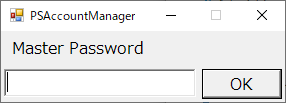
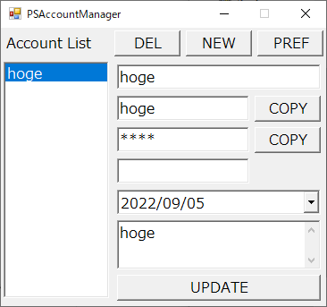

# PSAccountManager
PowerSehll Password Manager

:warning: Please be careful when using it. It's still buggy. :warning:

Run exec.bat to start PSAccountManager.  
The master password is not available in the current version. However, account data is encrypted with DPAPI.

  

Account data has the following values:
- label
- ID
- password
- date of expiry
- note

To add account data, first click the NEW button and enter the account data. You will need to enter the password twice for confirmation. Then click the UPDATE button to add the account.
